# 🚀 Tap Agent

Tap Agent is a minimalist AI Coding Agent running in the terminal. It leverages the **Google Gemini API** (supporting models like `gemini-2.5-flash`) and comes equipped with basic tools to interact with the operating system and file system.

This project serves as an ideal harness to learn how to design an Agentic Workflow from scratch: from managing LLM context and orchestrating tool calls using Generators (`yield`), to executing shell commands securely.

---

## 🏗️ Architecture

The core of Tap Agent follows a fundamental **ReAct (Reason + Act)** pattern and is tightly modularized. The system uses a "Flat Message" model to standardize I/O, making it easy to swap LLM providers if needed.

### Agent Pipeline

```mermaid
sequenceDiagram
    participant User
    participant CodingSession
    participant AgentHarness
    participant AgentLoop
    participant GeminiProvider
    participant Tools

    User->>CodingSession: Input prompt (CLI)
    CodingSession->>CodingSession: Save to History
    CodingSession->>AgentHarness: Call run(messages)
    
    rect rgb(30, 30, 30)
        Note right of AgentHarness: Start Agent Loop
        AgentHarness->>AgentLoop: run_agent_loop(messages)
        
        loop Max Iterations
            AgentLoop->>GeminiProvider: generate_reply()
            GeminiProvider-->>AgentLoop: Return ToolCall or Text Message
            
            alt Returns Tool Call
                AgentLoop-->>AgentHarness: yield AgentEvent.tool_call
                AgentHarness->>Tools: execute_tool_safely(call)
                Tools-->>AgentHarness: ToolResult (Output / Error)
                AgentHarness->>AgentLoop: asend(ToolResult) (Resume loop)
            else Returns Text
                AgentLoop-->>AgentHarness: yield AgentEvent.message
                AgentLoop-->>AgentHarness: yield AgentEvent.done
            end
        end
    end
    
    AgentHarness-->>CodingSession: Return Final Message
    CodingSession-->>User: Print to Terminal
```



### Pipeline Details:
1. **User Prompt**: The user types a command in the CLI. This command enters the `CodingSession` and is appended to the message list (chat context).
2. **Harness & Loop**: `AgentHarness` starts an asynchronous generator called `run_agent_loop`. This loop acts as the orchestrator for retry logic and enforces the maximum number of iterations (`max_iterations`).
3. **LLM Generation**: `AgentLoop` passes the entire chat history and Tool Schemas to the `GeminiProvider`. The Provider translates the internal schema to the Google SDK (`google-genai`) format, calls the Gemini API, and maps the response back.
4. **Tool Execution (Core mechanism)**: 
   - If Gemini decides to call a tool, it returns a list of `ToolCall`s.
   - `AgentLoop` immediately **`yield`s** (pauses the function) and pushes the tool call request out to the `AgentHarness`.
   - `AgentHarness` receives the request and safely calls `execute_tool()` in `Tools` (to read files or run bash commands).
   - Once the tool finishes running and yields a `ToolResult`, `AgentHarness` uses **`asend()`** to push the result back into the generator so `AgentLoop` can resume. (This Inversion of Control design keeps the loop logic highly decoupled and easy to mock for unit testing).
5. **Completion**: When Gemini decides not to call any more tools and returns plain text, the loop terminates and the string is printed to the CLI for the user.

---

## 📂 Directory Structure

```text
Tap/
├── pyproject.toml         # Project configuration (Python >=3.12, pydantic, google-genai)
├── .env                   # Contains GEMINI_API_KEY (git-ignored)
├── src/
│   ├── cli.py             # Entry point: Initializes session, interactive CLI loop
│   └── tap_agent/
│       ├── core_types.py      # Pydantic model definitions (Message, ToolCall, ToolResult...)
│       ├── provider.py        # Base interface for LLM Providers
│       ├── gemini_provider.py # Concrete implementation for Google Gemini API
│       ├── agent_loop.py      # Contains `run_agent_loop` - The logical heart of the Agent
│       ├── agent_harness.py   # Wrapper around the loop for safe tool exception handling
│       ├── coding_session.py  # Manages the history context of conversations
│       ├── tools.py           # Definitions and execution logic for tools (bash, read)
│       └── events.py          # Pub/sub streaming events mechanism (for logging)
└── tests/                 # Unit tests (pytest)
```

---

## 🧩 Core Components

- **`core_types.py`**: Where all data flow is strictly validated using `pydantic`. The `Message` model is designed flat (`role`, `content`, `tool_calls`) for natural cross-compatibility across multiple Providers (e.g., OpenAI, Anthropic).
- **`AgentLoop` (`agent_loop.py`)**: A pure Coroutine Generator. It does not execute tools itself. It only fetches the LLM result. If the LLM wants to call a tool, it throws an event (`yield`), forcing the outer layer (Harness) to handle it.
- **`AgentHarness` (`agent_harness.py`)**: Acts as the "nanny" for the AgentLoop. It executes tools and catches potential crashes (like Timeouts, File Not Found, Bad Commands), transforming the error into a `ToolResult.fail()` containing the error string to feed back to the LLM. This ensures the system doesn't crash completely, allowing the LLM to read the error and "self-correct".

---

## 🛠️ Built-in Tools

Located in `tools.py`, the Agent currently has two primary tools:

1. **`read` (Read file)**: 
   - Reads file contents securely within the boundaries of `PROJECT_ROOT`.
   - Blocks directory traversal attacks (path escape).
   - Supports `start_line` and `end_line` slicing, and enforces a maximum line limit (`MAX_READ_LINES`) to protect the Context Window.
2. **`bash` (Execute shell)**:
   - Runs shell commands asynchronously. On Windows, it intelligently locates Git Bash's `bash.exe` (to avoid Unix script compatibility issues), falling back to PowerShell if unavailable.
   - **Safety**: Automatically blocks destructive commands using static string matching (e.g., `rm -rf`, `format`, `shutdown`, `del /`, etc.).
   - Enforces a strict timeout (default 30s) by automatically killing the entire process tree.

---

## 🚀 Setup & Usage

### Prerequisites:
- Python >= 3.12
- UV or Pip

### Setup
1. Clone the project and install in editable mode:
   ```bash
   pip install -e .
   # or using uv
   uv pip install -e .
   ```
2. Create a `.env` file in the root directory and declare your GEMINI_API_KEY:
   ```env
   GEMINI_API_KEY="AIzaSy..."
   ```

### Running the Agent
Open your terminal and run:
```bash
python src/cli.py
```
An interactive chat interface will open. You can ask the Agent to interact with the project, for example:
- *"Check the src/cli.py file and tell me what it does"*
- *"Run pytest to test the project"*
- *"List all .py files using bash"*
